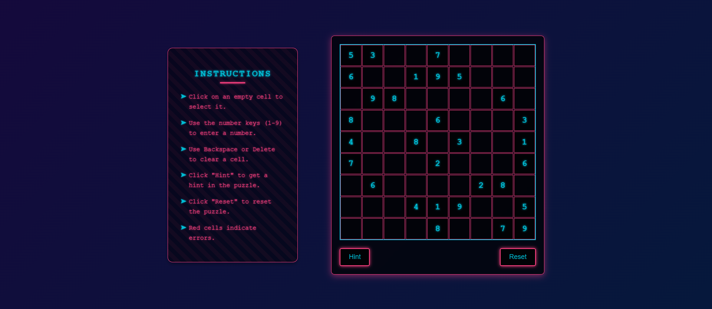

# Sudoku : Retro Synth Wave

This project is a web-based Sudoku game with a retro synthwave aesthetic. It features an animated gradient background, glowing elements, and a translucent game board, all designed to evoke the vibrant style of the 1980s.

## 🖼️ Preview
  

## 🚀 Features

- **Retro Synthwave Theme:** A visually appealing design with neon colors, glowing effects, and a rotating gradient background.
- **Interactive Sudoku Grid:** A 9x9 grid where users can input numbers and receive visual feedback on errors.
- **Hint System:** Provides a single valid number in a random empty cell to assist players.
- **Reset Functionality:** Allows users to reset the Sudoku board to its initial state.
- **Instruction Panel:** A stylish instruction panel with detailed guidance on how to play.
- **Responsive Design:** The game adapts to various screen sizes.

## ⚡ Technologies Used

- **HTML:** For structuring the web page.
- **CSS:** For styling the game with a retro synthwave theme, including animations and visual effects.
- **JavaScript:** For implementing the game logic, handling user interactions, and providing the hint system.

## 🎮 Gameplay

- Click on an empty cell to select it.
- Use the number keys (1-9) to enter a number.
- Use Delete to clear a cell.
- Click "Hint" to get a hint.
- Click "Reset" to reset the puzzle.
- Red cells indicate errors.
